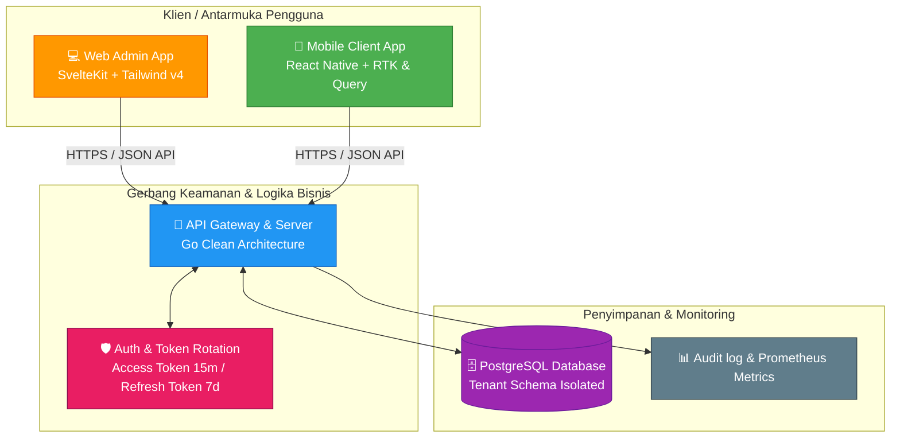

<div align="center">

# 🎓 Sekre

**Platform Manajemen & Kolaborasi Organisasi Kampus Terintegrasi**

[](https://go.dev/)
[](https://kit.svelte.dev/)
[](https://reactnative.dev/)
[](https://www.postgresql.org/)
[](LICENSE)

Sekre adalah platform Multi-tenant Software-as-a-Service (SaaS) yang dirancang khusus untuk memfasilitasi kebutuhan administrasi, kolaborasi, keuangan, dan manajemen kegiatan pada organisasi mahasiswa (BEM, Himpunan, UKM, dll). Platform ini mengintegrasikan server API performa tinggi, aplikasi dashboard web admin, dan aplikasi mobile Android/iOS untuk anggota di lapangan.

[Tentang Proyek](#-tentang-proyek) • [Arsitektur Sistem](#-arsitektur-sistem) • [Modul Aplikasi](#-modul-aplikasi) • [Quick Start](#-quick-start) • [Root Commands](#-root-level-commands)

</div>

---

## 📖 Tentang Proyek

Proyek **Sekre** bertujuan untuk menyelesaikan masalah klasik di lingkungan organisasi kemahasiswaan:
* **Siloisasi Informasi**: Data anggota, agenda, surat-menyurat, dan pembagian tugas seringkali tersebar di berbagai aplikasi chat atau spreadsheet personal.
* **Transparansi Keuangan**: Laporan kas masuk/keluar sulit diakses secara langsung oleh anggota dan rentan terhadap kesalahan perhitungan desimal.
* **Manajemen Tugas yang Buruk**: Pembagian kepanitiaan atau program kerja seringkali kurang termonitor progresnya.

Sekre hadir sebagai **satu platform tunggal** yang mampu membagi ruang kerja (workspace) secara aman per organisasi (Multi-tenancy) dengan kendali hak akses yang ketat (Role-Based Access Control) untuk Owner, Admin, dan Member.

---

## 🏗️ Arsitektur Sistem

Sekre dibangun menggunakan pendekatan arsitektur modern yang menjamin skalabilitas, kecepatan, serta keamanan data tingkat tinggi.



---

## 📦 Modul Aplikasi

Proyek Sekre dibagi menjadi 3 sub-direktori mandiri dengan teknologi pilihan di masing-masing areanya:

### 1. 🔙 [sekre-backend](file:///Users/ssajudn/projects/sekre-project/sekre-backend) (Go REST API Server)
Merupakan pusat pengolahan data dan logika bisnis utama yang dibuat menggunakan bahasa pemrograman Go.
* **Teknologi Utama**: Go 1.26, GORM v2, gorilla/mux, PostgreSQL 16, JWT, Zerolog, Prometheus.
* **Keunggulan Desain**:
  * **Clean Architecture**: Pemisahan layer yang ketat (`delivery` ➔ `application` ➔ `domain` ➔ `infrastructure`).
  * **Multi-tenant Isolation**: Setiap query database secara otomatis terfilter berdasarkan `organization_id` yang terikat pada kredensial pengguna.
  * **Safe Money Handling**: Perhitungan keuangan menggunakan representasi integer terkecil (cents) melalui tipe data khusus `valueobject.Money` demi menghindari galat pembulatan floating-point.
  * **Background Jobs Scheduler**: Menangani pembersihan sesi expired, audit logging, dan self-ping (khusus untuk deployment Render Free Tier).

*Detail selengkapnya silakan baca [📖 README Backend](./sekre-backend/README.md).*

---

### 2. 🎨 [sekre-frontend](file:///Users/ssajudn/projects/sekre-project/sekre-frontend) (SvelteKit Web Admin Dashboard)
Dashboard manajemen berbasis web untuk admin dan pengurus organisasi dalam mengelola struktur inti organisasi melalui layar lebar.
* **Teknologi Utama**: SvelteKit 2, Vite 8, TypeScript 6, Tailwind CSS v4.
* **Fitur Utama Web**:
  * **Dashboard Real-time**: Grafik dan bagan statistik tugas, keanggotaan, dan transaksi finansial terupdate.
  * **Divisions Manager**: Visualisasi divisi dan alokasi anggota ke divisi-divisi tertentu.
  * **Finance Ledger**: Pencatatan kas organisasi secara detail, filter jenis transaksi, dan laporan saldo akhir.
  * **Event Calendar**: Manajemen tanggal-tanggal penting, rapat koordinasi, dan agenda acara organisasi.
  * **Tasks Kanban**: Pengelolaan alur kerja tugas (TODO, IN PROGRESS, DONE) berbasis tim.
  * **User Settings & Org Profile**: Pembaruan info lisensi organisasi dan detail pengurus.

*Detail selengkapnya silakan baca [📖 README Frontend](./sekre-frontend/README.md).*

---

### 3. 📱 [sekre-mobile](file:///Users/ssajudn/projects/sekre-project/sekre-mobile) (React Native Client Application)
Aplikasi mobile lintas platform yang digunakan oleh seluruh anggota organisasi untuk berkolaborasi dan melapor dari manapun.
* **Teknologi Utama**: React Native 0.85.3 (TypeScript), Redux Toolkit, TanStack Query v5, MMKV v3, Keychain, React Navigation v7, React Native Reanimated v4.
* **Fitur Unggulan Mobile**:
  * **Offline Support & Fast Caching**: Manajemen sinkronisasi state server handal dengan TanStack Query.
  * **Security-First Storage**: Penyimpanan token JWT menggunakan enkripsi MMKV lokal di mana kunci enkripsinya disimpan secara aman di Android Keystore atau iOS Keychain.
  * **UI Premium**: Transisi layar halus menggunakan Reanimated, visualisasi loading shimmer (skeleton list), empty state yang informatif, serta notifikasi Toast interaktif.
  * **Task & Finance Tracker Mobile**: Kemudahan melapor pengeluaran kas atau merubah status tugas kepanitiaan langsung lewat genggaman tangan.

*Detail selengkapnya silakan baca [📖 README Mobile](./sekre-mobile/README.md).*

---

## 🚀 Quick Start

### 📦 Prasyarat Sistem
* **Backend**: Go 1.26+, PostgreSQL 16+, Docker (opsional).
* **Frontend**: Node.js 18+ (direkomendasikan Node 22), npm atau bun.
* **Mobile**: Node.js 18+, bun, Android Studio & SDK (Android), Xcode 15+ & CocoaPods (iOS, khusus pengguna macOS).

### ⚡ Langkah Setup Cepat

#### 1. Setup Database & Backend
```bash
cd sekre-backend

# Salin konfigurasi environment
cp .env.example .env
# Edit berkas .env untuk menyesuaikan JWT_SECRET dan kredensial database Anda

# Jalankan PostgreSQL via Docker (jika tidak menggunakan database lokal)
docker run --name sekre-pg -p 5432:5432 \
  -e POSTGRES_USER=postgres \
  -e POSTGRES_PASSWORD=yourpass \
  -e POSTGRES_DB=sekre_db \
  -d postgres:16-alpine

# Jalankan migrasi database & seed data demo
make migrate
make db-seed

# Mulai server API
make run
```
> Server backend akan berjalan secara default di **http://localhost:8080** (atau port yang disetel di `.env`).

#### 2. Setup Web Admin Frontend
```bash
cd ../sekre-frontend

# Install dependensi
bun install # atau: npm install

# Jalankan development server
bun run dev # atau: npm run dev
```
> Buka web browser di **http://localhost:5173** untuk mengakses dashboard.

#### 3. Setup Aplikasi Mobile
```bash
cd ../sekre-mobile

# Install dependensi
bun install

# Konfigurasi iOS (Khusus macOS)
cd ios && pod install && cd ..

# Jalankan metro bundler & luncurkan aplikasi
bun start
# (Di terminal terpisah)
bun android # Untuk Emulator Android
# atau
bun ios     # Untuk Simulator iOS
```

---

## 🛠️ Root-Level Commands

Di direktori utama proyek disediakan `Makefile` global untuk mempercepat alur kerja development harian Anda:

```bash
# 🚀 Menjalankan Service Lokal
make dev-backend    # Menjalankan API backend Go dengan Air (live reload)
make dev-frontend   # Menjalankan web admin frontend SvelteKit

# 🗄️ Manajemen Database
make db-seed        # Memasukkan data simulasi demo ke database
make db-reset       # Menghapus database, membuat ulang skema, dan mengisi ulang seed

# 🧪 Pengujian (Testing)
make test-backend   # Menjalankan unit & integration test untuk backend Go
make test-frontend  # Menjalankan test suite pada web frontend

# ✅ Validasi Struktur & Tipe data
make check-frontend # Menjalankan typecheck TypeScript pada modul frontend
```

---

<div align="center">

**Sekre — Membawa Manajemen Organisasi Kampus ke Era Digital 🚀**

Dibuat dengan ❤️ oleh tim pengembang Arah Baru Selayar untuk masa depan mahasiswa yang lebih terorganisir.

</div>
