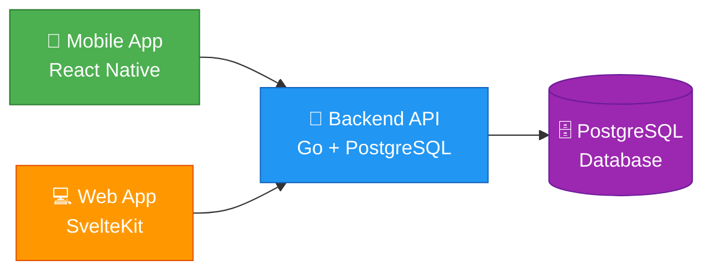

<div align="center">

# 🎓 Sekre

**Platform Manajemen Organisasi Kampus**

[](https://go.dev/)
[](https://kit.svelte.dev/)
[](https://reactnative.dev/)
[](https://www.postgresql.org/)
[](LICENSE)

Aplikasi lengkap untuk mengelola organisasi kampus (BEM, UKM, Himpunan) dengan fitur task management, event scheduling, finance tracking, dan kolaborasi tim.

[Fitur](#-fitur-utama) • [Quick Start](#-quick-start) • [Dokumentasi](#-dokumentasi) • [Arsitektur](#-arsitektur)

</div>

---

## ✨ Fitur Utama

<table>
<tr>
<td width="50%">

### 📋 Task Management

Kelola tugas dan deadline dengan assignment ke anggota, tracking progress, dan notifikasi otomatis.

### 📅 Event Scheduling

Jadwalkan acara organisasi, kelola peserta, dan kirim reminder ke anggota.

</td>
<td width="50%">

### 💰 Finance Tracking

Catat pemasukan & pengeluaran, generate laporan keuangan, dan export ke Excel.

### 👥 Multi-tenant

Isolasi data per organisasi dengan role-based access control (OWNER, ADMIN, MEMBER).

</td>
</tr>
</table>

---

## 🚀 Quick Start

### 📦 Prerequisites

```bash
# Backend
✓ Go 1.26+
✓ PostgreSQL 16+
✓ Docker (optional)

# Frontend
✓ Node.js 18+
✓ npm/bun

# Mobile
✓ Node.js 18+
✓ bun
✓ Android Studio
✓ Xcode 15+ (for iOS, macOS only)
✓ CocoaPods (for iOS)
```

### ⚡ Development Setup

<details>
<summary><b>🔧 Backend Setup</b></summary>

```bash
cd sekre-backend

# 1. Configure environment
cp .env.example .env
# Edit .env: set JWT_SECRET (min 32 chars) and DB credentials

# 2. Start PostgreSQL
docker run --name sekre-pg -p 5432:5432 \
  -e POSTGRES_USER=postgres \
  -e POSTGRES_PASSWORD=yourpass \
  -e POSTGRES_DB=sekre_db \
  -d postgres:16-alpine

# 3. Run migrations
make migrate

# 4. Seed demo data (optional)
make db-seed

# 5. Start server
make run
```

✅ Backend running on **http://localhost:8080**

</details>

<details>
<summary><b>🎨 Frontend Setup</b></summary>

```bash
cd sekre-frontend

# 1. Install dependencies
npm install
# or
bun install

# 2. Configure environment
cp .env.example .env
# Edit .env: set PUBLIC_API_URL

# 3. Start dev server
npm run dev
```

✅ Frontend running on **http://localhost:5173**

</details>

<details>
<summary><b>📱 Mobile Setup</b></summary>

```bash
cd sekre-mobile

# Install dependencies
bun install

# iOS only
cd ios && pod install && cd ..

# Start Metro bundler
bun start

# Android
bun android

# iOS
bun ios
```

> **API URL:** Android emulator → `http://10.0.2.2:8080/api/v1` | iOS simulator → `http://127.0.0.1:8080/api/v1`

</details>

---

## 🏗️ Arsitektur

### 🔄 System Architecture



### 🎯 Backend Architecture (Clean Architecture)

```
┌─────────────────────────────────────┐
│   🌐 HTTP Handlers (delivery)       │  ← Request/Response
├─────────────────────────────────────┤
│   ⚙️  Use Cases (application)       │  ← Business Orchestration
├─────────────────────────────────────┤
│   💼 Business Logic (domain)        │  ← Entities, Rules, Interfaces
├─────────────────────────────────────┤
│   🔧 Infrastructure (GORM, JWT)     │  ← Database, Auth, External
└─────────────────────────────────────┘
```

---

## 🛠️ Tech Stack

<table>
<tr>
<td width="33%" align="center">

### 🔙 Backend


**Framework:** gorilla/mux
**ORM:** GORM v2
**Auth:** JWT + bcrypt
**Architecture:** Clean Architecture

[📖 Backend Docs](./sekre-backend/README.md)

</td>
<td width="33%" align="center">

### 🎨 Frontend


**Framework:** SvelteKit 2
**Styling:** Tailwind CSS 4
**Build:** Vite 8
**Language:** TypeScript 6

</td>
<td width="33%" align="center">

### 📱 Mobile


**Framework:** React Native 0.85.3
**State:** Redux Toolkit + TanStack Query
**Storage:** MMKV + Keychain
**Platforms:** Android, iOS

[📖 Mobile Docs](./sekre-mobile/README.md)

</td>
</tr>
</table>

---

## 📚 Dokumentasi

### 🔗 API Documentation

| Endpoint                                              | Description                   |
| ----------------------------------------------------- | ----------------------------- |
| 📊 [Swagger UI](http://localhost:8080/docs)           | Interactive API documentation |
| 📄 [OpenAPI Spec](http://localhost:8080/openapi.yaml) | OpenAPI 3.0 specification     |
| ❤️ [Health Check](http://localhost:8080/health/live)  | Liveness probe                |
| 📈 [Metrics](http://localhost:8080/metrics)           | Prometheus metrics            |

### 🎯 Root-Level Commands

```bash
# 🗄️ Database
make db-seed        # Seed demo data
make db-reset       # Reset database + seed

# 🚀 Development
make dev-backend    # Start backend server
make dev-frontend   # Start frontend dev server

# 🧪 Testing
make test-backend   # Run backend tests
make test-frontend  # Run frontend tests

# ✅ Type checking
make check-frontend # Check frontend types
```

---

## 🔐 Security Features

<table>
<tr>
<td width="50%">

### 🛡️ Authentication & Authorization

- ✅ JWT with 15-minute access tokens
- ✅ Refresh token rotation
- ✅ Role-based access (OWNER, ADMIN, MEMBER)
- ✅ bcrypt password hashing

</td>
<td width="50%">

### 🔒 Security Layers

- ✅ Multi-tenant data isolation
- ✅ Rate limiting (10 req/s per IP)
- ✅ Input validation & XSS protection
- ✅ Row-level security (RLS) policies
- ✅ HTTPS with HSTS in production

</td>
</tr>
</table>

---

## 🧪 Testing

### Backend Testing

```bash
cd sekre-backend

make test              # 🧪 All tests
make test-unit         # ⚡ Unit tests (fast)
make test-integration  # 🐳 Integration tests (Docker)
make test-cover        # 📊 Coverage report (60%+ enforced)
```

**Coverage:** 60%+ enforced with unit, integration, and e2e tests.

### Frontend Testing

```bash
cd sekre-frontend

npm run test    # 🧪 Run tests
npm run check   # ✅ Type check
```

---

## 🌍 Environment Variables

<details>
<summary><b>🔧 Backend Configuration</b></summary>

**Required:**

- `JWT_SECRET` - At least 32 characters
- `DB_PASSWORD` - Database password

**Important:**

- `SERVER_PORT` - Default: 8080
- `DB_HOST` - Default: localhost
- `DB_PORT` - Default: 5432
- `DB_NAME` - Default: sekre_db
- `LOG_LEVEL` - Default: info

See [.env.example](./sekre-backend/.env.example) for full list.

</details>

<details>
<summary><b>🎨 Frontend Configuration</b></summary>

- `PUBLIC_API_URL` - Backend API URL (default: http://localhost:8080)

</details>

---

## 🚢 Production Deployment

### ✅ Backend Checklist

- [ ] Set `SERVER_ENV=production`
- [ ] Use strong `JWT_SECRET` (>= 32 chars)
- [ ] Enable SSL: `DB_SSLMODE=require`
- [ ] Set `LOG_LEVEL=info` or `warn`
- [ ] Configure `CORS_ALLOWED_ORIGINS`
- [ ] Set up reverse proxy (nginx/Caddy) with HTTPS
- [ ] Monitor `/metrics` with Prometheus
- [ ] Health checks on `/health/live` and `/health/ready`

### 🎨 Frontend Deployment

```bash
npm run build
# Deploy ./build directory to static hosting (Vercel, Netlify, etc.)
```

### 📱 Mobile Deployment

```bash
# Android — release APK
cd sekre-mobile
bun android --mode release

# iOS — archive (macOS only)
cd sekre-mobile/ios
xcodebuild -workspace SekreMobile.xcworkspace \
  -scheme SekreMobile -configuration Release archive
```

---

## 📁 Project Structure

```
sekre-project/
├── 🔙 sekre-backend/      # Go API server (Clean Architecture)
├── 🎨 sekre-frontend/     # SvelteKit web application
├── 📱 sekre-mobile/       # React Native mobile app (Android + iOS)
└── 📝 Makefile            # Root-level development commands
```

---

## 📄 License

Internal project.

---

<div align="center">

**Built with ❤️ for Campus Organizations**

🎓 BEM • 🎯 UKM • 📚 Himpunan

</div>
